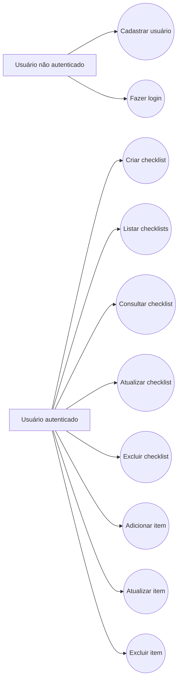
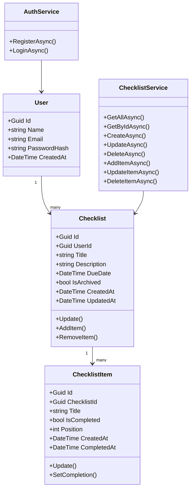
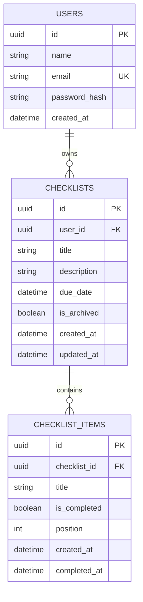
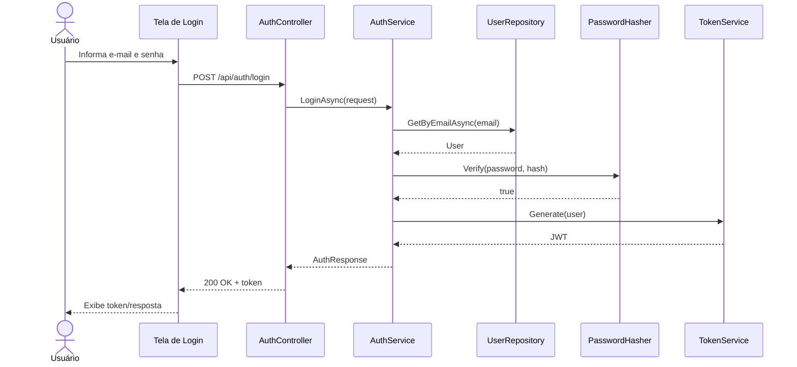
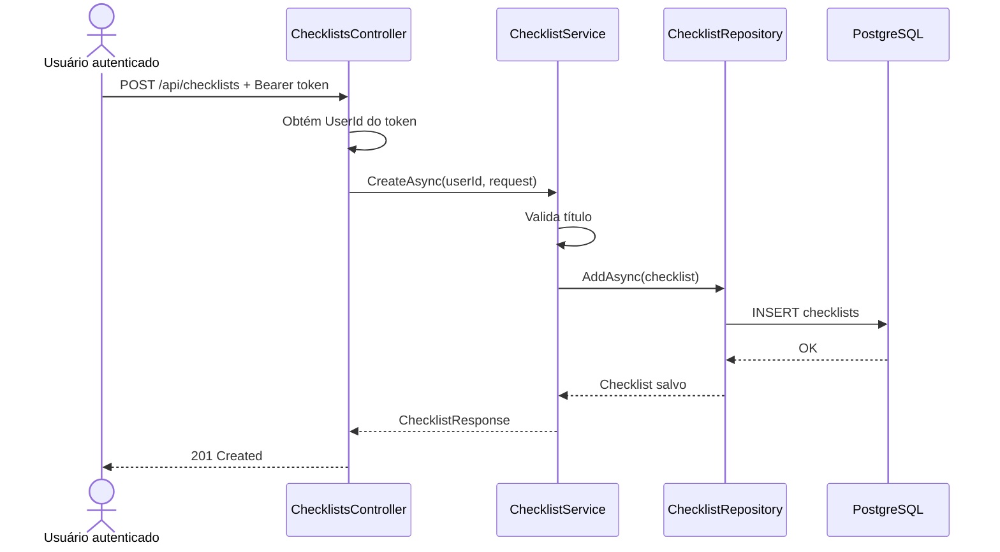

# Diagramas do Projeto

Os diagramas abaixo usam Mermaid, formato renderizado automaticamente pelo GitHub em arquivos Markdown.

## 1. Diagrama de casos de uso

## 2. Diagrama de classes

## 3. Diagrama entidade-relacionamento

## 4. Diagrama de sequência — Login

## 5. Diagrama de sequência — Criar checklist

